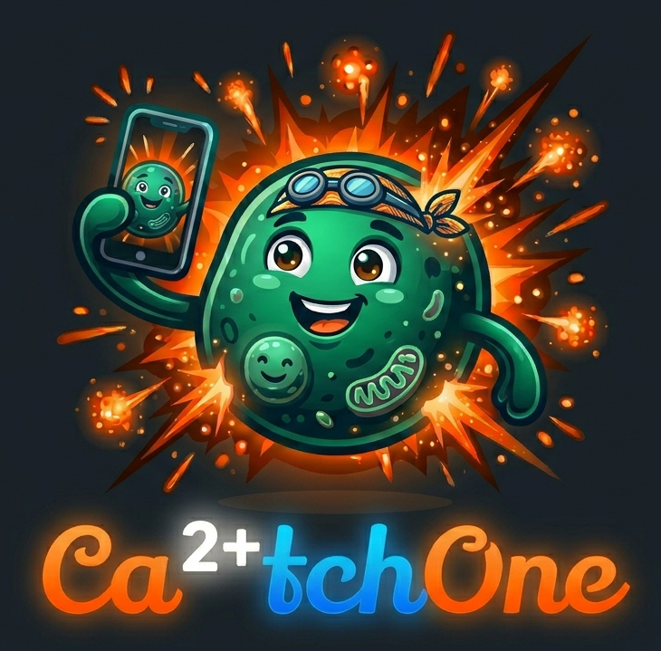

# Ca2+tch-One

<p align="center">
  
</p>

Ca2+tch-One is a browser-based ND2 analysis app for calcium-imaging experiments. It combines ROI detection, manual ROI editing, fluorescence or Fura-2 ratio trace extraction, event analysis, TG leak / Ca add-back assay quantification, and export into a single FastAPI-served app.

The current UI label is `v1.1.0-alpha`.

## What It Does

Ca2+tch-One is built for workflows where you want to:

- load Nikon `.nd2` recordings directly
- inspect ROI source and measurement datasets side by side
- detect ROIs from a projection image
- measure distances on the ROI source image
- add, merge, and delete ROIs manually
- copy ROIs from a source dataset into a measurement dataset
- analyze either single-channel fluorescence or Fura-2 ratio recordings
- use automatic or manually drawn background subtraction
- apply optional photobleach correction
- compute `DeltaF/F0` or `DeltaR/R0`
- quantify peak, AUC, event width, event frequency, rise time, time-to-peak, decay half-time, optional decay tau, and rate of rise
- quantify thapsigargin leak and calcium add-back responses
- export raw traces, analysis workbooks, and ROI overlay PNGs

## Intended Use

Ca2+tch-One is designed for **local use only**. It binds to `127.0.0.1` (localhost) and is not intended to be exposed on a network or shared server. There is no authentication system — anyone who can reach the port has full access. Run it on your own machine and open it in your local browser.

Do not deploy this app on a publicly accessible server or a shared lab machine without adding an authentication layer first.

## Running The App

The frontend is served by the FastAPI backend, so there is only one app to launch.

### Linux / macOS

From the repository root:

```bash
bash ./start.sh
```

If needed:

```bash
chmod +x start.sh
./start.sh
```

### Windows

From the repository root:

```bat
start.bat
```

Then open:

```text
http://localhost:8001
```

## What The Launchers Do

The startup scripts:

1. create `backend/venv` if needed
2. install or upgrade dependencies from `backend/requirements.txt`
3. start `uvicorn` on `127.0.0.1:8001`

Linux/macOS uses `--reload`; Windows starts the server without reload and opens the browser automatically.

## Requirements

- Python 3.12 recommended
- a browser that can open `http://localhost:8001`

Python packages are installed automatically by the launchers. Core dependencies include:

- `fastapi`
- `uvicorn`
- `nd2`
- `numpy`
- `scipy`
- `scikit-image`
- `Pillow`
- `psutil`
- `slowapi`

## Main Workflow

Typical use:

1. Load an `.nd2` file as `ROI Source`.
2. Inspect frames, channels, colormaps, and contrast.
3. Choose a detection projection and detection parameters.
4. Run `Detect Cells On Source`.
5. Refine ROIs if needed with `Measure On Source`, `Add ROI On Source`, `Merge 2 ROIs`, or `Delete ROIs`.
6. Load an `.nd2` file as `Measurement`.
7. Click `Copy ROIs To Measurement`.
8. Select which ROIs should be included in analysis.
9. Configure background correction, analysis mode, baseline and analysis windows, event settings, and optional assay windows.
10. Click `Analyze Measurement File`.
11. Review the trace and summary tabs.
12. Export the outputs you need.

## Dataset Roles

### ROI Source

This dataset is used for:

- ROI detection
- manual ROI editing
- ruler measurements
- visual inspection before transfer

### Measurement

This dataset is used for:

- trace extraction
- normalization
- event analysis
- TG leak analysis
- Ca add-back analysis
- export

The actual analysis runs on the measurement dataset after ROIs have been copied into it.

## Viewer Features

Both viewers provide:

- frame slider
- channel selector
- contrast min and max inputs
- percentile-based auto contrast
- selectable colormaps
- ROI overlays
- frame/time readout

The measurement viewer also supports ratio display when a valid Fura-2-style `340 / 380` channel pair is available or selected.

Display settings only affect visualization. They do not modify the underlying data.

## ROI Detection

ROI detection runs on the ROI source dataset and is projection-based, not activity-based.

Available detection controls:

- `Projection`: `Mean`, `Max`, or `Std`
- `Threshold adj.`
- `Smooth sigma (px)`
- `BG radius (px)`
- `Seed sigma (px)`
- `Min size (px^2)`
- `Max size (px^2)`
- `Compactness`
- `Keep edge ROIs`

Current pipeline:

1. build a 2D projection
2. normalize intensities using robust percentiles
3. smooth the image
4. remove slow background with a white top-hat filter
5. threshold the corrected image
6. clean the binary mask
7. generate watershed seeds from the distance transform
8. split touching cells
9. expand seeds to cell edges
10. filter ROIs by size and edge policy
11. convert final labels into polygon contours for the browser

## ROI Editing

After detection, ROIs can be edited on the ROI source dataset.

### Measure On Source

The ruler tool lets you measure distances directly on the source image.

### Add ROI On Source

Draw a polygon ROI directly in the source viewer.

Rules:

- the polygon must contain at least 3 image pixels
- it must not overlap an existing ROI

### Merge 2 ROIs

Select exactly two touching ROIs and merge them into one ROI.

### Delete ROIs

Remove one or more selected ROIs.

Any ROI edit clears downstream analysis results, so analysis must be rerun afterward.

## ROI Transfer And Selection

ROIs are copied from the source dataset to the measurement dataset with `Copy ROIs To Measurement`.

Important behavior:

- source and measurement images must have matching width and height
- the ROI list in the measurement context becomes the analysis-selection list
- unchecked ROIs are excluded from analysis and export summaries
- changing ROI selection invalidates existing analysis results until analysis is rerun

## Analysis Modes

Ca2+tch-One currently supports:

- `Single channel`
- `Fura-2 ratio`

For ratio analysis, the numerator and denominator channels must be different. The app is designed for `340 nm / 380 nm` style recordings but also allows manual channel selection.

## Background Correction

Available modes:

- `None`
- `Auto`
- `Manual ROI`

### Auto Background

Automatic background subtraction estimates a per-frame background from non-cell pixels after excluding ROIs and a configurable surrounding halo (`Cell margin`).

You can tune:

- `BG percentile`
- `Cell margin (px)`

### Manual Background

Manual mode lets you draw a polygon background region. Pixels overlapping ROIs or their halo are excluded from the background estimate.

## Signal Processing And Analysis Settings

Core analysis settings include:

- baseline start and end frame
- analysis window start and end frame
- photobleach correction: `None`, `Linear`, or `Single exponential`
- event threshold in `xMAD`
- event duration width fraction
- rise-time onset fraction
- optional decay tau fitting

Normalization is reported as:

- `DeltaF/F0` for single-channel analysis
- `DeltaR/R0` for ratio analysis

## Metrics And Plot Tabs

The app currently exposes these analysis views:

- `Raw Fluorescence (F)`
- `DeltaF / F0`
- `Peak + AUC`
- `Event FWHM`
- `Event Raster`
- `Rise Time`
- `Time To Peak`
- `Decay t1/2`
- `Decay tau`
- `Rate Of Rise`
- `TG Leak`
- `Ca Add-Back`

Computed metrics include:

- peak amplitude
- AUC
- event duration / FWHM
- event frequency
- rise time
- time to peak
- decay half-time
- optional decay tau
- rise rate
- per-ROI event times

The event raster can be sorted by:

- ROI ID
- event count
- first event
- peak amplitude

## TG Leak And Ca Add-Back Assays

The app includes dedicated analysis windows for:

- thapsigargin leak assays
- calcium add-back assays

You can configure:

- assay start frame
- assay end frame
- baseline window length in seconds
- slope-fit window length in seconds

When enabled, the app reports assay-specific peak, slope, and AUC values, plus add-back latency.

Set the assay start frame to `0` to disable that assay.

## Export Options

After analysis, the app can export:

- raw trace CSV
- analysis workbook (`.xlsx`)
- ROI overlay PNG for the current frame
- ROI overlay PNG for a projection view

### Raw CSV

Exports time in seconds plus one column per ROI.

### Analysis Workbook

Exports the analyzed traces and summary outputs in a multi-sheet Excel workbook.

### Overlay PNGs

Exports the current image view with ROI outlines and ROI IDs burned into the image.

## Supported Input And Current Limits

Current backend behavior includes:

- `.nd2` uploads only
- file-size limit: `700 MB` per upload
- default process memory guard: `1500 MB`
- inactive sessions expire after `2 hours`
- stale-session cleanup runs every `5 minutes`

The memory limit can be changed with:

```text
CACELLFIE_MAX_RSS_MB
```

Setting that environment variable to `0` disables the RSS guard.

## Notes And Caveats

- Analysis requires ROIs to exist on the measurement dataset.
- Ratio mode requires two different channels.
- Manual background selection must leave non-ROI pixels available after halo exclusion.
- Copying ROIs between datasets requires matching image dimensions.
- Editing or retransferring ROIs clears prior analysis outputs.
- The app keeps session data in memory rather than writing project files to disk.

## Repository Layout

```text
frontend/
  index.html
  app.js
  style.css
backend/
  main.py
  analysis.py
  detection.py
  image_io.py
  requirements.txt
start.sh
start.bat
```
